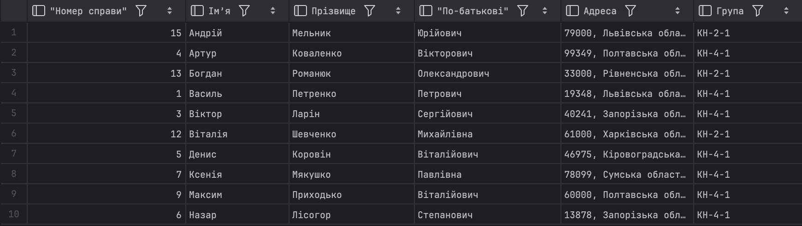

# Test cases:
### Test Case ID: TC_FUN_01
**Summary:** Verify sorting functionality for the Name column in the Students List  
**Test Case Type:** Functional  
**Priority:** High  
**Precondition:** User is logged in and on the Students List Page  
**Status:** Failed  
**Author/Designer:** Viktoriia Rul  
**Created Date:** 2025/08/25

**Test Steps:**

| N  | Test Step                                         | Test Data                     | Expected Result                                         |
|----|--------------------------------------------------|-------------------------------|--------------------------------------------------------|
| 1  | Locate the Name column header                     |                               | Name column is visible                                  |
| 2  | Click on the Name column header to sort ascending|                               | Students list is sorted alphabetically by name A-Z     |
| 3  | Click on the Name column header again to sort descending |                     | Students list is sorted alphabetically by name Z-A     |
| 4  | Verify that the sorting works with mixed case names | Names with uppercase and lowercase | Sorting is case-insensitive and correct               |
| 5  | Verify that clicking multiple times toggles between ascending and descending | | Sorting toggles correctly                               |

**Post-condition:** Students list returns to default order after page reload

---

### Test Case ID: TC_FUN_02
**Summary:** Verify filter functionality by Group Name in the Students List  
**Test Case Type:** Functional  
**Priority:** High  
**Precondition:** User is logged in and on the Students List Page  
**Status:** Pass  
**Author/Designer:** Viktoriia Rul  
**Created Date:** 2025/08/25

**Test Steps:**

| N  | Test Step                                         | Test Data      | Expected Result                                     |
|----|--------------------------------------------------|---------------|----------------------------------------------------|
| 1  | Locate the Group filter dropdown                 |               | Group filter is visible                             |
| 2  | Select a valid group name from dropdown          | Group A       | Students list displays only students from Group A  |
| 3  | Select another group name                        | Group B       | Students list displays only students from Group B  |
| 4  | Select an empty or "All" option                  |               | Students list displays all students                |
| 5  | Enter invalid group name (if searchable)        | Group X       | No students found message is displayed            |

**Post-condition:** Students list returns to default state after clearing filter

---

### Test Case ID: TC_UI_01
**Summary:** Verify that Name, Surname, and Middle Name are fully displayed in their respective columns  
**Test Case Type:** UI  
**Priority:** Medium  
**Precondition:** User is logged in and on the Students List Page  
**Status:** Pass  
**Author/Designer:** Viktoriia Rul  
**Created Date:** 2025/08/25

**Test Steps:**

| N  | Test Step                                         | Test Data      | Expected Result                                    |
|----|--------------------------------------------------|---------------|---------------------------------------------------|
| 1  | Locate Name, Surname, and Middle Name columns   |               | Columns are visible                                |
| 2  | Check if full Name is displayed without truncation | Long names  | Full name is visible in column                     |
| 3  | Check if full Surname is displayed without truncation | Long surnames | Full surname is visible in column                |
| 4  | Check if full Middle Name is displayed without truncation | Long middle names | Full middle name is visible in column        |
| 5  | Verify responsiveness on smaller screens        |               | Columns adjust properly and names remain readable |

**Post-condition:** Columns return to default view after page reload

---

### Test Case ID: TC_UI_02
**Summary:** Verify pagination functionality using the Next Page button  
**Test Case Type:** UI  
**Priority:** Medium  
**Precondition:** User is logged in and on the Students List Page with multiple pages of data  
**Status:** Failed  
**Author/Designer:** Viktoriia Rul  
**Created Date:** 2025/08/25

**Test Steps:**

| N  | Test Step                                         | Test Data | Expected Result                                           |
|----|--------------------------------------------------|-----------|----------------------------------------------------------|
| 1  | Locate pagination controls                        |           | Pagination buttons are visible                           |
| 2  | Click the Next Page button                        |           | Next page of students is displayed                        |
| 3  | Click the Previous Page button                    |           | Previous page of students is displayed                   |
| 4  | Verify that the current page number updates correctly |       | Current page number matches the displayed data           |
| 5  | Click Next Page on last page                       |           | Next Page button is disabled or no change occurs         |
| 6  | Verify page size consistency                       |           | Number of students per page matches expected             |

**Post-condition:** Pagination returns to first page after page reload

---

# Defects:
### Defect ID: DF_01
**Summary:** [Functional] Sorting students by Name column does not sort correctly  
**Defect Type:** Functional  
**Priority:** High  
**Severity:** High  
**Environment:** Chrome v139, Windows 10 / iPhone 14 Safari  
**Precondition:** User is logged in and on the Students List Page  
**Status:** Open  
**Author/Designer:** Viktoriia Rul  
**Created Date:** 2025/08/25

**Steps to Reproduce:**

| N  | Test Step                                         | Test Data                      |
|----|--------------------------------------------------|--------------------------------|
| 1  | Navigate to Students List Page                   |                                |
| 2  | Click on the Name column header to sort ascending |                              |
| 3  | Observe the order of students                    |                                |
| 4  | Click on the Name column header again to sort descending |                        |
| 5  | Observe the order of students                    |                                |
| 6  | Check sorting with names containing mixed cases  | Names like “Anna”, “anna”, “ANNA” |

**Actual Result:** Students are not sorted correctly alphabetically; mixed-case names appear out of order.  
**Expected Result:** Students should be sorted correctly in ascending and descending alphabetical order, ignoring case sensitivity.

---

### Defect ID: DF_02
**Summary:** [Performance] Students List page loads slowly  
**Defect Type:** Non-functional - Performance  
**Priority:** Medium  
**Severity:** Medium  
**Environment:** Chrome v139, Windows 10  
**Precondition:** User is logged in and on the Students List Page

**Steps to Reproduce:**

| N  | Test Step                  | Test Data |
|----|----------------------------|-----------|
| 1  | Navigate to Students List Page |       |
| 2  | Measure page load time       |       |
| 3  | Perform sorting by Name column |    |
| 4  | Observe page response time   |       |

**Actual Result:** Page loads in 5.6 seconds, which exceeds expected ≤2 seconds.  
**Expected Result:** Page should load within 2 seconds.

---

### Defect ID: DF_03
**Summary:** [UI] Total number of students displayed incorrectly (1-10 of 7)  
**Defect Type:** Non-functional - Usability  
**Priority:** Medium  
**Severity:** Medium  
**Environment:** Chrome v139, Windows 10  
**Precondition:** User is logged in and on the Students List Page

**Steps to Reproduce:**

| N  | Test Step                          | Test Data |
|----|-----------------------------------|-----------|
| 1  | Navigate to Students List Page     |           |
| 2  | Observe total students count in pagination section | |

**Actual Result:** Displays “1-10 of 7” even though total students are 7.  
**Expected Result:** Displays “1-7 of 7”.

---

### Defect ID: DF_04
**Summary:** [Compatibility] Students List page not fully visible on iPhone  
**Defect Type:** Non-functional - Compatibility  
**Priority:** High  
**Severity:** High  
**Environment:** iPhone 12, Safari  
**Precondition:** User is logged in to the system on iPhone

**Steps to Reproduce:**

| N  | Test Step                                         | Test Data |
|----|--------------------------------------------------|-----------|
| 1  | Navigate to Students List page                   |           |
| 2  | Observe page layout and visibility of search field, students table, and pagination controls | |

**Actual Result:** Search field is visible, students table shows 10 students with vertical scrolling, but pagination controls are not visible at the bottom.  
**Expected Result:** Search field, students table, and pagination controls should be fully visible and usable on mobile devices.

---

### Defect ID: DF_05
**Summary:** [Usability] Pagination “Next Page” button not functioning correctly  
**Defect Type:** Non-functional - Usability  
**Priority:** Medium  
**Severity:** Medium  
**Environment:** Chrome v139, Windows 10  
**Precondition:** User is logged in and on the Students List Page with multiple pages

**Steps to Reproduce:**

| N  | Test Step                 | Test Data |
|----|---------------------------|-----------|
| 1  | Navigate to Students List Page |       |
| 2  | Click “Next Page” button   |           |
| 3  | Observe the displayed students |       |
| 4  | Click “Next Page” again    |           |
| 5  | Observe if the page changes |         |

**Actual Result:** Clicking “Next Page” sometimes does not update the student list.  
**Expected Result:** Clicking “Next Page” updates the student list and the page number consistently.


---

## SQL база данных (SQLite)

A SQLite database was created as an example solution for visualizing the homework.
A migration script was written and applied.

### Migration
[migrate.sql](migrate.sql)

### Seed
[seed.sql](seed.sql)

### SQL query
```sql
SELECT
    s.student_id AS "Номер справи",
    s.first_name AS "Ім’я",
    s.last_name AS "Прізвище",
    s.middle_name AS "По-батькові",
    s.address AS "Адреса",
    g.group_name AS "Група"
FROM students s
         LEFT JOIN groups g
                   ON s.group_id = g.group_id
ORDER BY s.first_name ASC
LIMIT 10;
```
### Resalt SQL query

